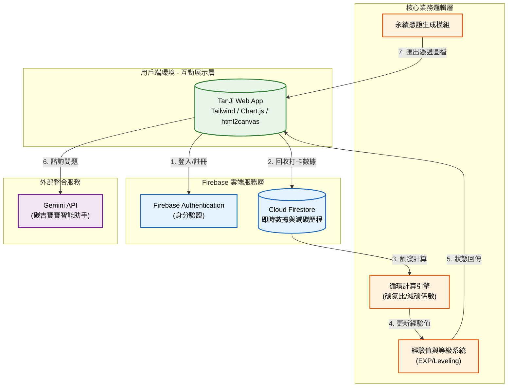

# 碳吉圈圈 TanJi Loop：在地微型循環網絡平台 🌿

## 1. 專案介紹

### 1.1 系統目的簡介

本系統旨在建立一套透明且有趣的在地資源循環機制，專注於解決都市生活中產生的「咖啡渣」與「落葉」廢棄物問題。透過數位化管理與遊戲化設計，引導社區居民參與「高溫好氧發酵」轉化過程，將廢棄物轉變為高經濟價值的「黑金土」。系統提供即時減碳軌跡追蹤、碳吉寶寶養成互動以及數位永續憑證匯出，將無感的環保行為轉化為具體的數位資產與社區回饋。

---

## 2. 系統架構與範圍

### 2.1 系統架構圖

本系統採用雲端原生架構設計，整合 Firebase 即時資料庫與 AI 智能助手，確保數據的高同步性與使用者互動品質。



### 2.2 系統範圍

- 展示層：使用 Tailwind CSS 建立響應式介面，整合 Chart.js 展示個人與全球減碳進度，並提供 html2canvas 進行憑證圖像化處理。
- 數據處理層：基於 Firebase Firestore 監聽機制，實現回收量與碳排規避數據的即時同步。
- 邏輯運算層：包含 45 天發酵週期狀態追蹤、咖啡渣轉黑金土換算率（約 0.7 倍）以及減碳係數計算。
- AI 互動層：串接 Gemini API 提供關於循環經濟、好氧發酵知識的即時諮詢服務。

### 2.3 交付項目

1. 網頁應用程式：`index.html` 及其關聯之 JavaScript 模組。
2. 數據庫架構：Firebase Firestore 安全規則與資料結構定義。
3. 視覺資產：碳吉寶寶系列動畫影片與圖檔。
4. 系統技術文檔：本規格說明書。

---

## 3. 業務功能需求

本節描述系統針對不同角色提供的核心功能。

| 需求編號 | 功能名稱 | 參與者 | 功能描述 | 業務邏輯/備註 |
| --- | --- | --- | --- | --- |
| FR-01 | 身分驗證系統 | 居民/訪客 | 支援匿名體驗與 Email 註冊登入。 | 登入後可同步雲端數據，確保歷程不丟失。 |
| FR-02 | 資源回收打卡 | 居民/商家 | 記錄咖啡渣（氮源）或落葉（碳源）的回收重量。 | 數據需即時反應至個人減碳軌跡與全球進度條。 |
| FR-03 | 碳吉寶寶養成 | 使用者 | 依據 EXP 經驗值自動升級寶寶等級。 | 經驗值與回收量成正比，每 200 EXP 升一級。 |
| FR-04 | 數位憑證匯出 | 使用者 | 一鍵產出包含證書編號、姓名與減碳數據的圖檔。 | 採用 html2canvas 技術，支援手機端下載分享。 |
| FR-05 | 智能助手諮詢 | 使用者 | 透過對話視窗詢問發酵流程或循環知識。 | 後端串接 AI 模組進行活潑且專業的語意回答。 |
| FR-06 | 實體回饋兌換 | 居民/店家 | 達到指定等級（300/800 EXP）可解鎖實體兌換權限。 | 前端展示兌換條碼或憑證供現場核銷。 |

---

## 4. 非業務功能需求

### 4.1 安全性要求

- 資料存取控制：透過 Firebase Security Rules 確保使用者僅能讀寫自有的 profile 資料。
- API 保護：對 AI 助手之請求進行前端節流（Throttling），防止惡意洗流量。

### 4.2 系統效能

- 即時同步：Firestore 數據異動需在 1 秒內反映於前端 UI 圖表。
- 載入速度：首頁關鍵渲染路徑優化，確保在 4G 環境下 2 秒內完成主要元件載入。

### 4.3 準確性與可用性

- 計算精度：減碳數據需精確至小數點後一位。
- 跨裝置相容：支援 Chrome, Safari, Edge 瀏覽器，並對手機垂直瀏覽進行高度優化。

---

## 5. 系統數據結構設計

### 5.1 Firestore 資料模型

系統數據存儲於 `artifacts` 根目錄下。

#### 使用者統計數據 (User Stats)

- Path: `/artifacts/tanji-loop-2026/users/{uid}/profile`
- 格式:
```json
{
  "stats": {
    "waste": 15.5,
    "carbon": 8.6,
    "soil": 10.8,
    "exp": 450,
    "level": 3
  }
}
```

#### 全域進度數據 (Global Data)

- Path: `/artifacts/tanji-loop-2026/public/data/global`
- 格式:
```json
{
  "campaign": {
    "totalWaste": 250,
    "participants": 125
  }
}
```

---

## 6. 專案開發與部署

### 前置需求

- Node.js 環境（用於編譯或 Firebase CLI）。
- Firebase 專案 API Key 與授權憑證。
- Gemini API Key。

### 部署步驟

1. 初始化環境：設定 Firebase Hosting 與 Firestore Rules。
2. 配置環境變數：將 API 金鑰填入系統指定位置。
3. 前端佈署：將 `index.html` 與相關資產上傳至靜態託管空間（如 GitHub Pages 或 Firebase Hosting）。
4. 功能驗證：進行跨裝置測試，確保 O2O 掃碼與憑證下載功能運作正常。
