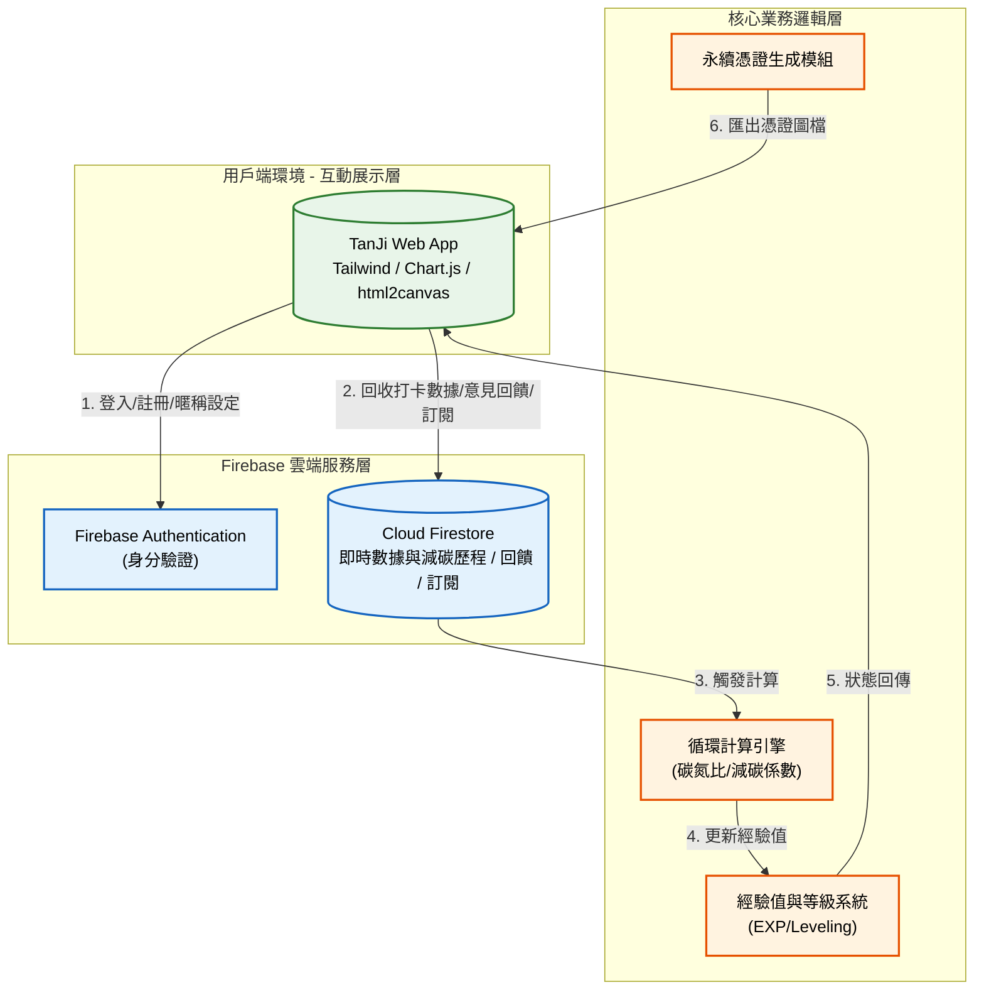

# 碳吉圈圈 TanJi Loop：在地微型循環網絡平台系統規格說明書 🌿

## 1. 專案介紹

### 1.1 系統目的簡介

本系統旨在建立一套透明且有趣的在地資源循環機制，專注於解決都市生活中產生的「咖啡渣」與「落葉」廢棄物問題。透過數位化管理與遊戲化設計，引導民眾、學校及里民辦公室參與「高溫好氧發酵」轉化過程，將廢棄物轉變為高經濟價值的「黑金土」。系統提供即時減碳軌跡追蹤、碳吉寶寶養成互動、數位永續憑證匯出、操作指引教材、問題回報歷史記錄與電子報訂閱功能，將環保行為轉化為具體的數位資產與社區回饋。

---

## 2. 系統架構與範圍

### 2.1 系統架構圖

本系統採用雲端原生架構設計，整合 Firebase 即時資料庫與雲端服務，確保數據的高同步性與使用者互動品質。


```mermaid
graph TD
    classDef client fill:#e8f5e9,stroke:#2e7d32,stroke-width:2px,color:black
    classDef cloud fill:#e3f2fd,stroke:#1565c0,stroke-width:2px,color:black
    classDef logic fill:#fff3e0,stroke:#e65100,stroke-width:2px,color:black

    subgraph Client_Side [用戶端環境 - 互動展示層]
        WebApp[("TanJi Web App<br>Tailwind / Chart.js / html2canvas")]:::client
    end

    subgraph Firebase_Cloud [Firebase 雲端服務層]
        Auth["Firebase Authentication<br>(身分驗證)"]:::cloud
        Firestore[("Cloud Firestore<br>即時數據與減碳歷程 / 回饋 / 訂閱")]:::cloud
    end

    subgraph Logic_Engine [核心業務邏輯層]
        Cycle_Engine["循環計算引擎<br>(碳氮比/減碳係數)"]:::logic
        Level_System["經驗值與等級系統<br>(EXP/Leveling)"]:::logic
        Cert_Generator["永續憑證生成模組"]:::logic
    end

    WebApp -- "1. 登入/註冊/暱稱設定" --> Auth
    WebApp -- "2. 回收打卡數據/意見回饋/訂閱" --> Firestore
    Firestore -- "3. 觸發計算" --> Cycle_Engine
    Cycle_Engine -- "4. 更新經驗值" --> Level_System
    Level_System -- "5. 狀態回傳" --> WebApp
    Cert_Generator -- "6. 匯出憑證圖檔" --> WebApp

```

### 2.2 系統範圍

* **展示層**：使用 Tailwind CSS 建立響應式介面，支援手機平板漢堡選單導覽、Chart.js 個人減碳進度圖表，並提供 html2canvas 進行憑證圖像化下載。
* **數據處理層**：基於 Firebase Firestore 監聽機制，實現回收量、全球進度條、動態牆及管理員審核機制的即時同步。
* **邏輯運算層**：包含發酵廢棄物轉黑金土換算率（0.7 倍）、減碳係數計算（每公斤減 0.56 kg CO2e）與經驗值升級判定。
* **管理與後勤層**：提供具備 `admin` 權限之帳號專屬主控台，處理用戶回饋與回覆、一鍵匯出電子報訂閱名單、插播系統公告及校正全站數據。

### 2.3 交付項目

1. **主網頁應用程式**：`tanji_loop_app.html`。
2. **實作指引教材**：`tanji_guide.html`（專為學校、社區與里民辦公室設計之離線儲存教材）。
3. **數據庫架構**：Firebase Firestore 安全規則（RBAC 權限控管）。
4. **視覺資產**：碳吉寶寶系列動畫影片與圖檔。

---

## 3. 業務功能需求

| 需求編號 | 功能名稱 | 參與者 | 功能描述 | 業務邏輯/備註 |
| --- | --- | --- | --- | --- |
| FR-01 | 身分驗證與個人化 | 居民/訪客 | 支援匿名體驗與 Email 註冊（可自訂暱稱）。 | 暱稱將顯示於導覽列與動態牆。 |
| FR-02 | 資源回收打卡 | 居民/店家 | 記錄咖啡渣（氮源）或落葉（碳源）重量與現場照片。 | 數據即時反應至個人軌跡與全球進度，廣播至動態牆。 |
| FR-03 | 碳吉寶寶養成 | 使用者 | 依據 EXP 經驗值自動升級寶寶等級。 | 經驗值與回收量成正比，每 200 EXP 升一級。 |
| FR-04 | 數位憑證匯出 | 使用者 | 一鍵產出包含證書編號、暱稱與減碳數據的專屬圖檔。 | 採用 html2canvas 技術，支援跨裝置下載。 |
| FR-05 | 意見回饋與歷史 | 使用者 | 提交問題或建議，並可檢視歷史紀錄與管理員回覆。 | 分為待處理與已回覆狀態。 |
| FR-06 | 實體回饋兌換 | 居民/店家 | 達到指定等級（300/800 EXP）解鎖實體兌換權限。 | 達標可扣除 EXP 進行實體核銷。 |
| FR-07 | 電子報訂閱 | 訪客/用戶 | 輸入 Email 訂閱最新在地永續資訊。 | 儲存至專屬集合，供管理員一鍵匯出名單。 |
| FR-08 | 管理員主控台 | 管理員 | 檢視/回覆意見、匯出訂閱名單、發布公告、校正全站總量。 | 需讀取 Firestore User 集合中的 `role == 'admin'` 屬性解鎖。 |

---

## 4. 非業務功能需求

### 4.1 安全性要求

* **資料存取控制 (Firestore Rules)**：
* `users`：僅限本人與管理員讀寫。
* `public/global`：所有人可讀，登入者可更新。
* `feeds`：所有人可讀，登入者可新增，僅管理員可刪改。
* `feedbacks`：登入者可新增與讀取自有紀錄，僅管理員可讀取全部並進行回覆。
* `newsletters`：所有人可新增，僅管理員可讀取與管理。


### 4.2 系統效能

* **即時同步**：Firestore 數據異動需在 1 秒內反映於前端 UI 儀表板與動態牆。
* **輕量化表現**：不依賴大型框架，確保在行動裝置瀏覽器上快速流暢渲染。

### 4.3 準確性與可用性

* **計算精度**：減碳與黑金土數據需精確至小數點後一位。
* **跨裝置相容**：UI 採用 Tailwind CSS，對手機漢堡選單、平板與桌機進行自適應高度優化。

---

## 5. 系統數據結構設計

系統數據存儲於 `/databases/(default)/documents/artifacts/{appId}/` 節點下。

### 5.1 使用者資料 (Users)

* **Path**: `users/{uid}`

```json
{
  "name": "王大明",
  "email": "user@example.com",
  "role": "user", 
  "stats": {
    "waste": 15.5,
    "carbon": 8.6,
    "soil": 10.8,
    "exp": 450,
    "level": 3
  }
}

```

### 5.2 全域進度數據 (Global)

* **Path**: `public/global`

```json
{
  "campaign": {
    "totalWaste": 250,
    "participants": 125
  }
}

```

### 5.3 社區動態牆 (Feeds)

* **Path**: `feeds/{feedId}`

```json
{
  "name": "王大明",
  "action": "貢獻了 <span class='font-bold text-white'>5 kg 咖啡渣</span>",
  "reward": "+50 EXP",
  "img": "data:image/jpeg;base64,...",
  "timestamp": 1704067200000,
  "timeStr": "剛剛"
}

```

### 5.4 意見回饋 (Feedbacks)

* **Path**: `feedbacks/{feedbackId}`

```json
{
  "uid": "user_uid_here",
  "user": "王大明",
  "feature": "功能建議",
  "content": "希望能增加地圖導航功能。",
  "status": "已回覆",
  "reply": "感謝建議，已列入升級藍圖！",
  "timestamp": 1704067200000
}

```

### 5.5 電子報訂閱 (Newsletters)

* **Path**: `newsletters/{newsletterId}`

```json
{
  "email": "user@example.com",
  "timestamp": 1704067200000
}

```

---

## 6. 專案開發與部署

### 6.1 前置需求

* Firebase 專案 API Key 與相關設定物件。

### 6.2 部署步驟

1. **初始化資料庫**：開啟 Firebase Firestore 並貼上專案專屬之 Security Rules。
2. **管理員配置**：於應用程式註冊帳號後，至 Firestore 手動將該 `uid` 文件內的 `role` 欄位值修改為 `"admin"`。
3. **前端佈署**：將 `.html` 檔案與 `assets` 資料夾上傳至靜態託管空間（如 GitHub Pages 或 Firebase Hosting）。
